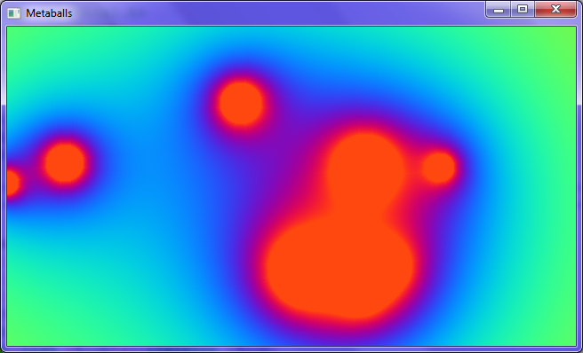
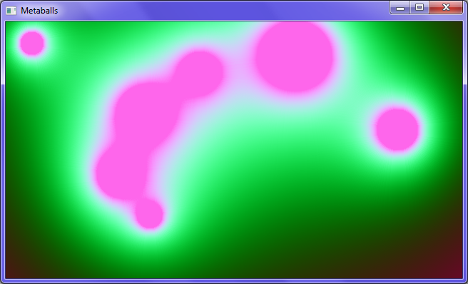

# Metaballs
Two dimensional metaballs made on C++ with SFML

In order to compile this program you need to install SFML 2.4.1 or above, for more information go to https://www.sfml-dev.org

## Screenshots

